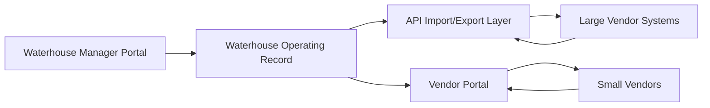

# API and Vendor Integration Strategy

Waterhouse should support two vendor operating models:

- Large vendors with their own software and APIs.
- Smaller vendors without SaaS who need a basic Waterhouse-provided vendor portal.

The goal is to keep Waterhouse's internal operating record consistent while allowing each vendor to interact at the level their business can support.

## Integration Model

## Vendor Categories

### API-Enabled Vendors

Examples:

- Large asphalt companies.
- Property management platforms.
- Screening providers.
- Payment processors.
- Accounting systems.
- CRM or brokerage platforms.

Capabilities:

- Import job status.
- Export work orders.
- Sync estimates.
- Sync invoices.
- Sync documents.
- Receive webhook updates.
- Map vendor-specific IDs to Waterhouse records.

### Portal-Only Vendors

Examples:

- Small paving crews.
- Local maintenance contractors.
- Handyman vendors.
- Small inspection vendors.
- Independent service providers.

Capabilities:

- View assigned work.
- Accept or decline jobs.
- Update job status.
- Upload photos.
- Add notes.
- Submit invoice details.
- Receive simple notifications.

If the vendor does not pay for their own SaaS, they can pay Waterhouse for a basic vendor SaaS experience inside the Waterhouse ecosystem.

## Core API Objects

### Vendor

Fields:

- id
- name
- type
- contactName
- email
- phone
- website
- apiEnabled
- portalEnabled
- billingModel
- notes

### VendorIntegration

Fields:

- id
- vendorId
- providerName
- authType
- baseUrl
- status
- lastSyncAt
- webhookUrl
- externalVendorId

### WorkOrder

Fields:

- id
- vendorId
- ownerType
- ownerId
- communityId
- residentId
- ticketId
- pavingJobId
- status
- priority
- scope
- scheduledStart
- scheduledEnd
- externalWorkOrderId

### VendorUpdate

Fields:

- id
- vendorId
- workOrderId
- status
- note
- photoUrls
- invoiceAmount
- externalUpdateId
- createdAt

## Import and Export Patterns

### Export to Vendor API

Use when Waterhouse creates or updates work:

1. Manager creates ticket, paving job, or project task.
2. Waterhouse maps it to a vendor work order.
3. Integration layer sends payload to vendor API.
4. Vendor API returns external ID.
5. Waterhouse stores external ID on the work order.

### Import from Vendor API

Use when vendor systems are source for status or documents:

1. Scheduled sync or webhook receives vendor update.
2. Integration layer validates vendor ID and payload.
3. Waterhouse maps external IDs to internal records.
4. Work order status, notes, photos, invoice details, or documents update.
5. Audit event is created.

### Portal Update from Small Vendor

Use when vendor has no API:

1. Vendor signs into Waterhouse vendor portal.
2. Vendor sees assigned work orders only.
3. Vendor updates status or uploads photos.
4. Manager receives notification.
5. Waterhouse record updates immediately.

## Vendor Portal Functional Scope

### Vendor Dashboard

- Assigned jobs.
- Due dates.
- Community or property address.
- Contact instructions.
- Status and priority.

### Job Detail

- Scope.
- Notes.
- Photos.
- Schedule.
- Access instructions.
- Completion checklist.

### Vendor Actions

- Accept job.
- Decline job.
- Update status.
- Add note.
- Upload photos.
- Submit invoice amount.
- Mark complete.

### Vendor Permissions

Vendors can:

- See only assigned work.
- Update their own job statuses.
- Upload job-related files.
- Submit invoice information.

Vendors cannot:

- See resident financial records.
- See owner reports.
- Assign other vendors.
- Edit Waterhouse internal notes.
- Access other vendor jobs.

## Billing Model for Vendor SaaS

For smaller vendors without software:

- Free tier for basic job acceptance and completion updates.
- Paid tier for invoice history, photo archive, reporting, and multiple users.
- Optional per-vendor monthly SaaS fee.
- Optional pass-through fee bundled into vendor management services.

Waterhouse should keep this simple. The purpose is operational visibility, not to become a full field-service platform on day one.

## API Security

- Use per-vendor credentials.
- Store secrets outside the frontend.
- Rotate credentials.
- Log every sync.
- Validate webhook signatures.
- Rate-limit inbound endpoints.
- Never expose API keys in portal code.

## Roadmap

### Phase 1

- Vendor entity.
- Manual vendor assignment.
- Portal-only vendor workflow.
- Photo and note upload.

### Phase 2

- API integration abstraction.
- Scheduled import/export jobs.
- Webhook receiver.
- External ID mapping.

### Phase 3

- Vendor billing tiers.
- Vendor reporting.
- Multi-user vendor accounts.
- Integration health dashboard.

## Open Questions

- Which vendors are confirmed API-enabled?
- Which service lines need vendor portal first: paving, maintenance, inspections, or all?
- Should vendor billing be direct subscription or bundled into Waterhouse service fees?
- What documents can vendors upload without manager review?
- Which fields must sync back to owner reports?
