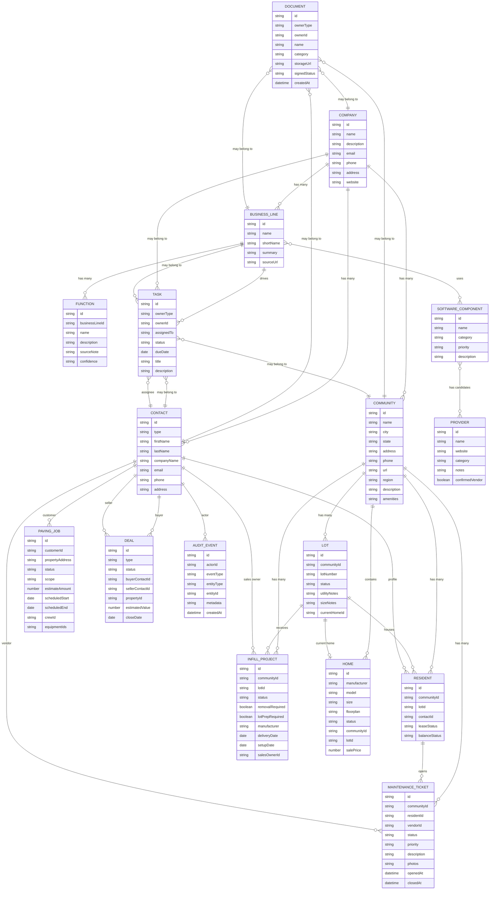

# Initial Data Model

This model is derived from the public site and the operating workflows implied by the business lines.

## Entity Relationship Diagram

## Core Entities

### Company

Fields:

- id
- name
- description
- email
- phone
- address
- website

Relationships:

- has many business lines
- has many communities
- has many contacts

### BusinessLine

Fields:

- id
- name
- shortName
- summary
- sourceUrl

Examples:

- Property and Asset Management
- Manufactured Home Dealership and Infill
- Asphalt Paving
- Real Estate Brokerage

Relationships:

- has many functions
- has many software components
- has many workflows

### Function

Fields:

- id
- businessLineId
- name
- description
- sourceNote
- confidence

Examples:

- rent collection
- tenant screening
- lot preparation
- hot asphalt paving
- transaction management

### SoftwareComponent

Fields:

- id
- name
- category
- priority
- description

Examples:

- property management system
- resident payment portal
- construction estimating
- real estate CRM

Relationships:

- belongs to many business lines
- has many providers

### Provider

Fields:

- id
- name
- website
- category
- notes
- confirmedVendor

Examples:

- AppFolio
- Yardi Breeze
- Rent Manager
- HubSpot
- JobTread
- HCSS
- Follow Up Boss

Important:

Provider names currently mean "candidate providers," not confirmed vendors.

## Property Management Entities

### Community

Fields:

- id
- name
- city
- state
- address
- phone
- url
- region
- description
- amenities

Relationships:

- has many lots
- has many residents
- has many maintenance tickets
- has many inspections

### Lot

Fields:

- id
- communityId
- lotNumber
- status
- utilityNotes
- sizeNotes
- currentHomeId

Statuses:

- occupied
- vacant
- needs removal
- ready for home
- under setup

### Resident

Fields:

- id
- communityId
- lotId
- contactId
- leaseStatus
- balanceStatus

### MaintenanceTicket

Fields:

- id
- communityId
- residentId
- vendorId
- status
- priority
- description
- photos
- openedAt
- closedAt

## Dealership and Infill Entities

### Home

Fields:

- id
- manufacturer
- model
- size
- floorplan
- status
- communityId
- lotId
- salePrice

Statuses:

- planned
- ordered
- in transit
- delivered
- setup
- listed
- sold

### InfillProject

Fields:

- id
- communityId
- lotId
- status
- removalRequired
- lotPrepRequired
- manufacturer
- deliveryDate
- setupDate
- salesOwnerId

## Asphalt Entities

### PavingJob

Fields:

- id
- customerId
- propertyAddress
- status
- scope
- estimateAmount
- scheduledStart
- scheduledEnd
- crewId
- equipmentIds

Statuses:

- lead
- assessment scheduled
- estimated
- approved
- scheduled
- in progress
- complete
- invoiced

## Brokerage Entities

### Deal

Fields:

- id
- type
- status
- buyerContactId
- sellerContactId
- propertyId
- estimatedValue
- closeDate

Types:

- single family home
- manufactured home
- mobile home park
- apartment complex
- raw land
- commercial property

## Shared Entities

### Contact

Fields:

- id
- type
- firstName
- lastName
- companyName
- email
- phone
- address

Types:

- resident
- prospect
- owner
- vendor
- contractor
- buyer
- seller
- investor
- staff

### Document

Fields:

- id
- ownerType
- ownerId
- name
- category
- storageUrl
- signedStatus
- createdAt

### Task

Fields:

- id
- ownerType
- ownerId
- assignedTo
- status
- dueDate
- title
- description

### AuditEvent

Fields:

- id
- actorId
- eventType
- entityType
- entityId
- metadata
- createdAt
